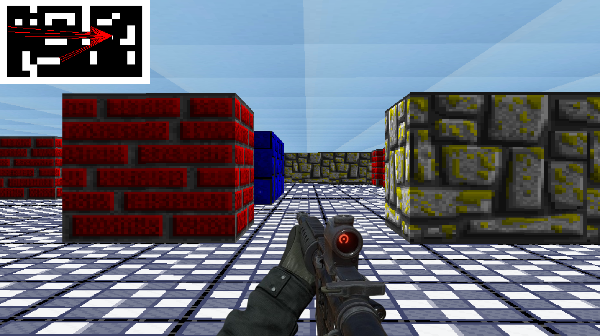

**Project Title: Maze 3D Game Using Raycasting**



### Overview
Welcome to the Maze 3D Game project! This project is a simple 3D maze game built using raycasting techniques. It allows you to navigate through a maze in a first-person perspective, using keyboard controls to move around and explore the environment.

### Project Structure
The project follows a simple directory structure:

- **src**: Contains all the source code files.
- **headers**: Contains header files with function declarations and constants.
- **images**: Holds image assets used in the game.

### Dependencies
This project relies on the following dependencies:
- **SDL2**: A cross-platform development library designed to provide low-level access to audio, keyboard, mouse, joystick, and graphics hardware.
- **SDL2_image**: An extension library that enables loading and saving images in various formats.

### Installing Libraries and Compiling Guide
Before compiling the project, make sure you have SDL2 and SDL2_image installed on your system. You can install them using your package manager:

```bash
sudo apt-get install libsdl2-dev
sudo apt-get install libsdl2-image-dev
```

Once the dependencies are installed, you can compile the project using GCC:

```bash
gcc -g src/*.c -lm -lSDL2 -lSDL2_image -o maze_game
```

### Running the Game
After compiling the project, you can run the executable:

```bash
./maze_game
```

### Features Implemented
- First-person perspective navigation.
- Rendering of a 3D maze using raycasting techniques.
- Keyboard controls for movement (WASD for navigation).

### How to Control or Activate Features
- Use the **W** key to move forward.
- Use the **S** key to move backward.
- Use the **A** key to strafe left.
- Use the **D** key to strafe right.

### Introducing SDL2 and Raycasting for Understanding
- **SDL2**: SDL2 is a powerful library that simplifies the process of creating graphical applications. It provides functions for handling windows, rendering graphics, and capturing user input.
- **Raycasting**: Raycasting is a rendering technique used to create a 3D perspective effect in 2D environments. It involves casting rays from the player's viewpoint and calculating intersections with objects in the scene to determine what is visible.

### About Me
I'm passionate about game development and enjoy exploring different techniques to create immersive gaming experiences. This project is a result of my experimentation with raycasting and SDL2.

### Thanks
Thank you for checking out the Maze 3D Game project! Feel free to explore the code, make modifications, and have fun navigating through the maze. If you have any questions or suggestions, please don't hesitate to reach out.

**Happy gaming!**
